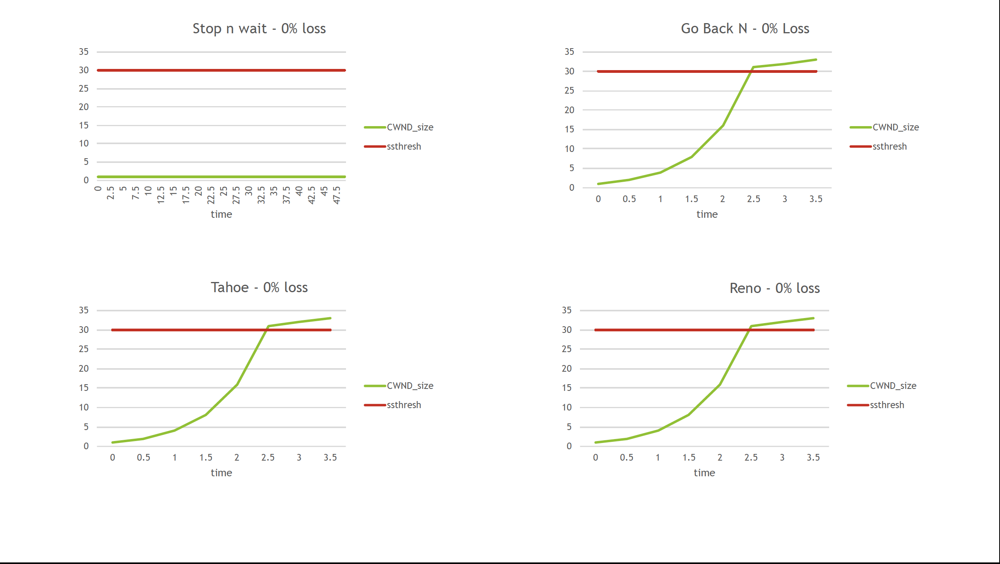
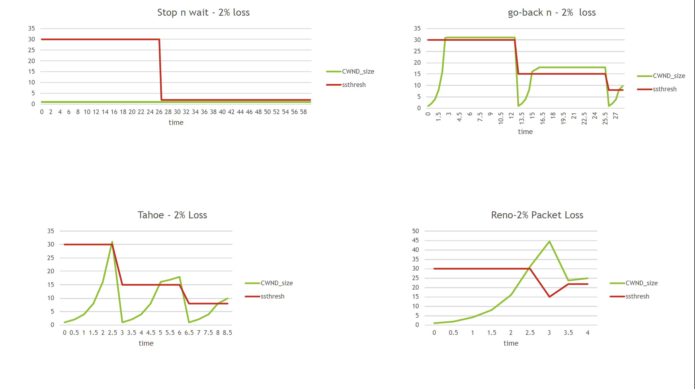
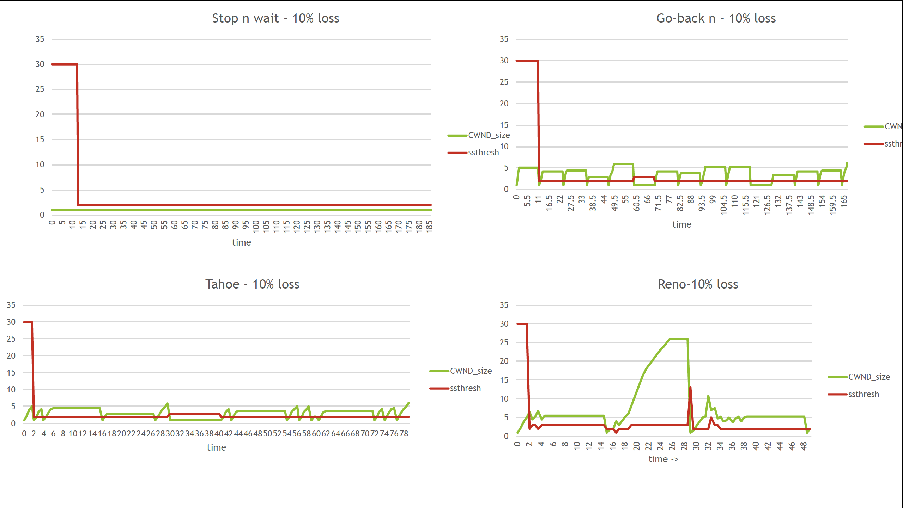

# Comparison of Different TCP flavors
##### contributors: 
Alimuddin Khan (aak5031@rit.edu) and 
Nisha Bhanushali (nnb7791@rit.edu )
***
### Goals of TCP 
* There are two basic goals of TCP

1. **Congestion control**: It involves controlling the sending rate as per network congestion
2. **Reliable data transfer**: It involves retransmission and correction of a lost or corrupt packet

---
### Topics covered in this project
* In this project we will looking at performance of TCP protocol with following features;
    1. TCP with Stop-n-wait
    2. TCP with Go-back-n (sliding window)
    3. TCP Tahoe (sliding window, fast retransmit)
    4. TCP Reno (sliding window, fast retransmit, fast recovery)
* If you want to read more about what features we have covered, you can read this [pdf](src/FCN-Term-Project-ppt.pdf)


--- 
### Running the Program
##### STEP 1: Environment Setup
* For running this program you just need java 1.8 or higher
* No extra library or tool is required to run this program

##### Step2: Compile the source code
You can easily compile  source code using standard command as follows;
```
javac *.java
```

##### Step3: Running the program
The program has 3 stages.
##### 1. Start Router
* In our program Router is has two functionalities.
   1. To randomly drop packets with certain probability
   2. To create a bottle neck (to simulate tail drop) by changing queue length
* You can start router using following command
```
java Router <qs> <seed> <pl>
```
where,

|Parameter| Details |
| :------: | :-----:|
|\<qs\>| Queue size (can decide bottle neck size) |
|\<seed\>| Seed for random drop simulator |
|\<pl\>| Percentage loss e.g. 2 or 4, or any number between 0-100 |

* Example:
```
java Router 1000 123456 10
```
* Above command starts the router with queue length 1000 and percentage of packet loss equal to  10%. 
Random loss generator will use the seed 123456 to create the random loss
* Once your program starts running you can type command 'me' to get the router machine IP.
* Router IP will be  required while starting the TCP sender

##### 2. Start Receiver
* Receiver receives the packet and sends acknowledgement accordingly.
* At a time it can receive packets from different sources and can respond with different 
senders with their respective acknowledgements.
* You can start a receiver using following command;
```
java RunTCP 0
```
* Make sure that you type this command as it is, because this same program can also act as sender
if we pass different parameters.
* Once your program starts running you can type command 'me' to get the destination host IP.
* Destination IP will be  required while starting the TCP sender 

##### 3. Start Sender
* It represents the TCP sender.
* It performs congestion control and flow control as per network congestion and TCP flavor used.
* You can Run TCP sender using following command;
```
java RunTCP <nd> [<destIP> <np> <is> <tcp-type> <routerTP>] [....]
```

where,

|Parameter| Details |
| :------: | :-----:|
|\<nd\>|Number of destinations to which we want to send the packets |
|\<destIP\>| Destination IP |
|\<np\>| Number of Packets to send |
|\<is\>| Initial Sequece for those set of packets|
|\<tcp-type\>| TCP type/ feature to use. Options are 1. stopnwait 2. gobackn 3. tahoe 4. reno|
|\<routerIP\>| IP of the router host machine |

* As we can see, we can send to more than one destination via more than one router at the same time.
* Same program  acts as the TCP receiver if we pass different command line parameters.
* e.g.
```
java RunTCP 1 129.21.30.** 100 200 reno 129.21.34.**
```
* Above command sends 100 packets (with ISN 200 i.e. packets with sequence numbers from 200 to 299) to 
destination 129.21.30.\*\* via router  129.21.34.**

---
### Sample Output
##### step1: Start router 
* This command should be run on router host.
```
java Router 1000 123456 0
```
* It will produce following output;

```
ALERT(Router): Router Started
ALERT(MyListener): Starting socket for  listener.......
SUCCESS(MyListener): successfully started listener socket  on 55556 port
Queue Length : 1000
Seed : 123456
Packet loss : 0.0%
```
* If you are able to see this output, then your router has successfully started.

##### step2: Start receiver
* This command should be run on the receiver host
```
java RunTCP 0
```
* It will produce the following output

```
ALERT(RunTCP): Starting TCP protocol
ALERT(MyListener): Starting socket for  listener.......
SUCCESS(MyListener): successfully started listener socket  on 55556 port
```

* If you are able to see this output, then your receiver has successfully started.

##### step 3: Start the sender
* This command should be run on sender machine.

```
java RunTCP 1 129.21.30.** 100 100 reno 129.21.37.**
```

* It will produce the following output. 
(NOTE: Asterisk marks are to be replaced by proper destination and Router machine IPs in the above command)

```
ALERT(RunTCP): Starting TCP protocol
ALERT(MyListener): Starting socket for  listener.......
SUCCESS(MyListener): successfully started listener socket  on 55556 port
Setting Router addreess!!
    t CWND_size  ssthresh              status
 0.00      1.00        30           slowstart
 0.50      2.00        30           slowstart
 1.00      4.00        30           slowstart
 1.50      8.00        30           slowstart
 2.00     16.00        30           slowstart
 2.50     31.03        30 congestionAvoidance
 3.00     32.03        30 congestionAvoidance
 3.50     33.03        30 congestionAvoidance
ALERT(RunTcp): Took 3626 milliseconds to send all packets

```
---
### How to compare TCP versions?
* You can change loss percentage in th router side to see how the given TCP version behaves(time taken to send the packets).
* You can also change the TCP version type on the sender side to see the change in performance.
---

### TCP comparison Graphs
* We ran the program for different TCP version (Or TCP with different features) with different percentages of packet loss.
* Using the output produced by those programs we came up with following graphs.
1. 0% packet Loss:


2. 2% packet Loss:


3. 10% packet Loss:



##### Observations
1. TCP Reno and TCP Tahoe behave exactly same when there is no packet loss.
2. As packet loss increases TCP reno behaves far better than rest of the TCP versions ((Or TCP with different features)). 
2. There are more Time Outs for other versions of TCPs than in TCP Reno for the given packet loss %.

---
### Contact Us
* If you have any suggestion or you find any mistake in our implementations please feel free to contact us.


